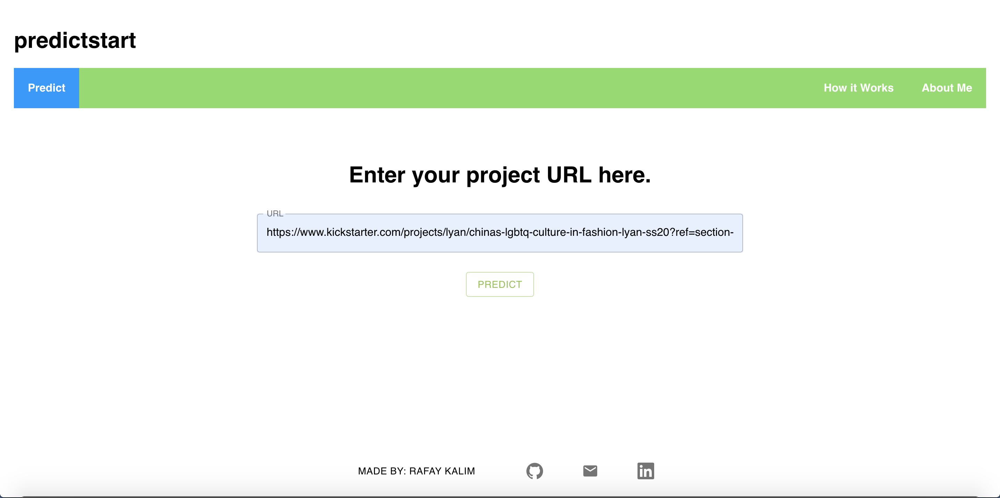

A website for prediction of success of a kickstarter project, along with top 5 feature contributions to prediction

# How it works

An LGBM Classifier was trained on a dataset of over 300,000 kickstarter projects. The data processing, feature selection and model generation can be found here:

https://www.kaggle.com/rafayk7/kickstarter-real

A web scraper gathers necessary data, is normalized by the saved Normalizer and preprocessed as needed, and fed into the LGBMClassifier to make the shown prediction!
SHAP values are used to calculate feature importance.

# Screenshots

